# ChapterChat AI

ChapterChat AI es una aplicación móvil para libros digitales que transforma
completamente la experiencia de lectura tradicional, fusionando la organización convencional de
bibliotecas digitales con funcionalidades avanzadas impulsadas por inteligencia artificial. La
plataforma permite a los escritores publicar sus obras y proporcionar información detallada sobre
sus personajes, mientras que los lectores pueden leer e interactuar con los personajes mediante un
sistema de chat conversacional basado en IA.

## ✨ Características
* **Interacción con Personajes:** Chat en tiempo real con personajes del libro mediante IA.
* **Resúmenes Inteligentes:** Generación de resúmenes automáticos por página.
* **Modo Lectura:** Interfaz limpia y optimizada para la lectura.
* **Gestión Local:** Los libros y conversaciones se guardan en el dispositivo.

---

## 🛠️ Manual Técnico

### Tecnologías Utilizadas
*   **Framework:** [Flutter](https://flutter.dev) - Desarrollo multiplataforma.
*   **Autenticación:** [Firebase Auth](https://firebase.google.com) - Manejo de inicio de sesión y registro.
*   **Base de Datos Remota:** [Firestore Database](https://firebase.google.com) - Almacenamiento de usuarios, libros y transacciones.
*   **Almacenamiento de Archivos:** [Cloud Storage](https://firebase.google.com) - Hosting de PDFs y portadas de libros.
*   **Gestión de Estado:** [BLoC](https://pub.dev) - Comunicación principal entre Backend y Frontend.
*   **Persistencia Local:** [Hive](https://pub.dev) - Almacenamiento de libros comprados e historial de chats.

### 🏗️ Arquitectura del Sistema

La aplicación sigue el flujo: **UI ↔️ BLoC ↔️ Backend**, asegurando una responsabilidad definida para cada componente.

#### Gestión de Estados (7 BLoCs principales)
*   **Login:** Gestiona estados de sesión consultando a Firebase Auth.
*   **Payment:** Procesa el flujo de "pago" y emite estados de éxito o fallo.
*   **Book:** Administra libros en Firestore/Storage, vinculación con autores y datos de la tienda.
*   **Chat:** Conecta con el modelo de IA (**Gemini - Capa gratuita**) y gestiona el historial local con Hive.

#### Inyección de Dependencias (Providers)
Se utilizan 3 Providers para distribuir información en el árbol de widgets:
*   **Ads:** Genera widgets de anuncios (Reward, Banner y Native). El *Reward Ad* permite enviar mensajes sin ser Premium.
*   **Theme:** Controla el modo claro/oscuro y la paleta de colores.
*   **User:** Almacena información volátil del usuario (incluyendo estatus Premium) obtenida desde el User BLoC para personalizar la experiencia.

### 📦 Módulos Principales
1.  **Autenticación:** Registro, verificación de correo e inicio de sesión (BLoCs: *User, SignUp, Login*).
2.  **Biblioteca:** Módulo central que gestiona la compra y descarga de contenido local/remoto (BLoCs: *Book, Library, Payment*).
3.  **Chat con IA:** Encargado de dar vida a los personajes y persistir las conversaciones localmente (BLoC: *Chat*).

# Vista Previa

### 1. Pantalla de inicio de sesión y registro

  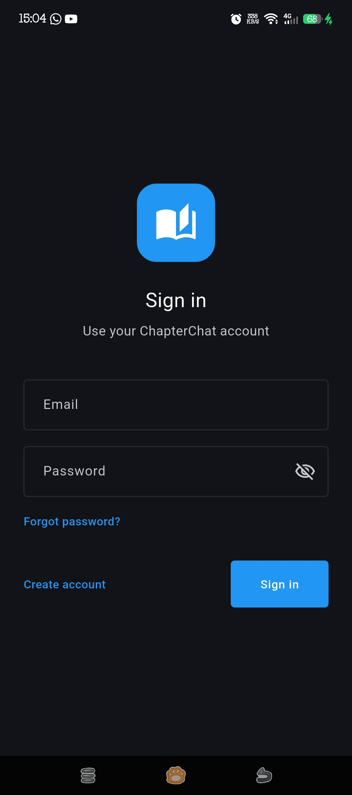
  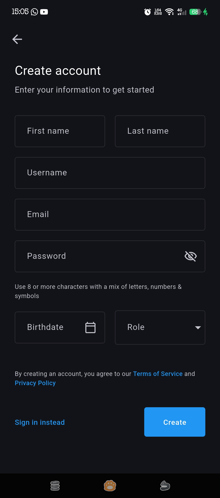

### 2. Pantalla de libros guardados localmente

  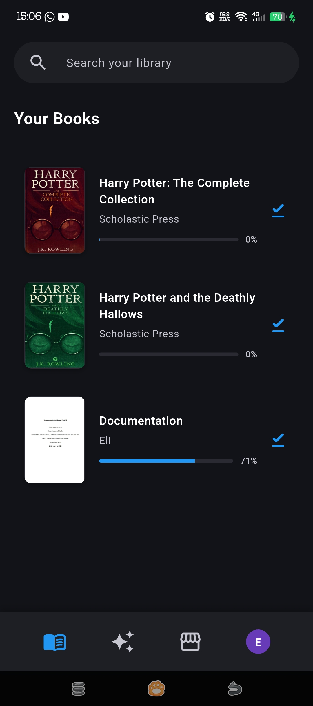

### 3. Pantalla de detalles de un libro

  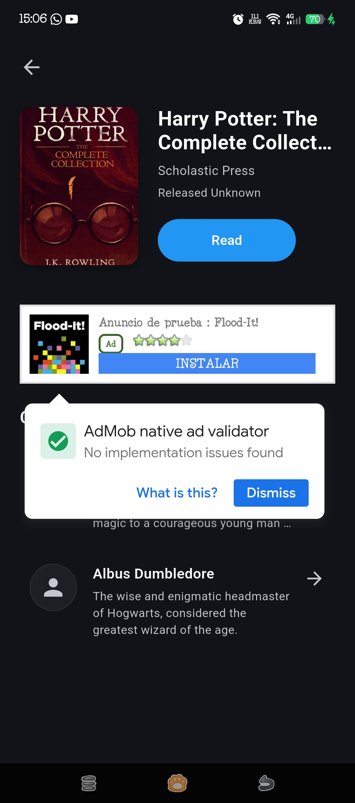

### 4. Vista en modo lectura de un libro

  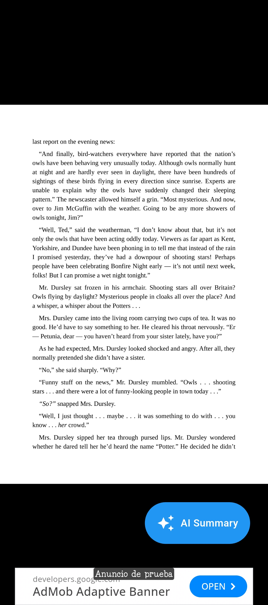

### 5. Resumen del contenido de una página impulsado con AI

  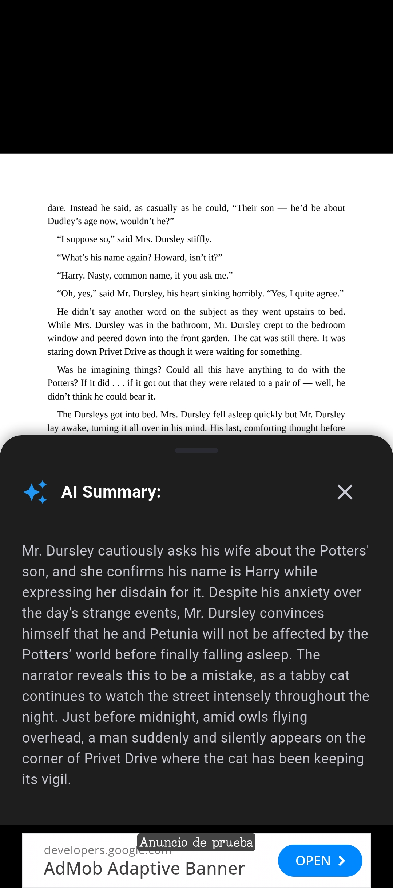

### 6. Pantalla de chats locales

  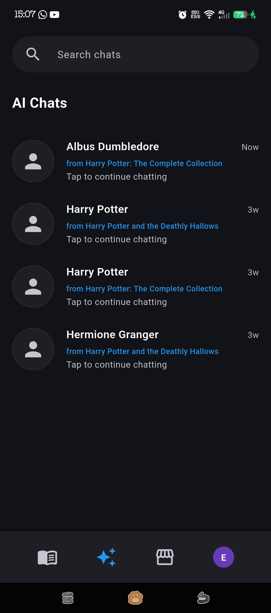
  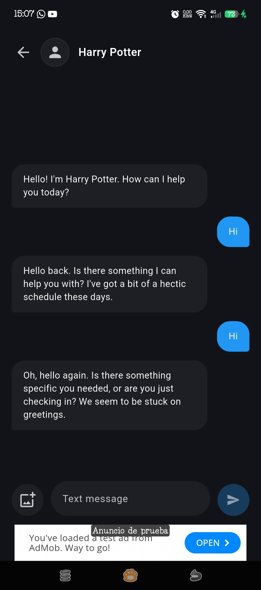

### 7. Tienda de libros

  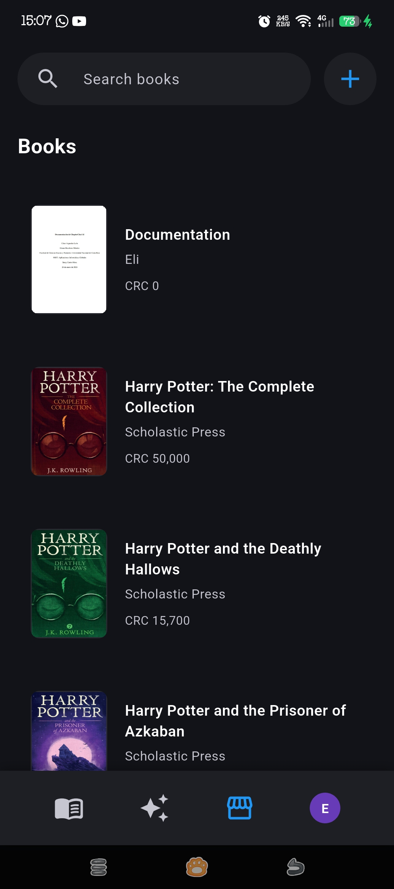

### 8. Pantalla de los detalles de un libro más formulario de compra

  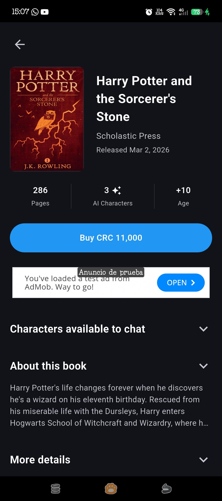
  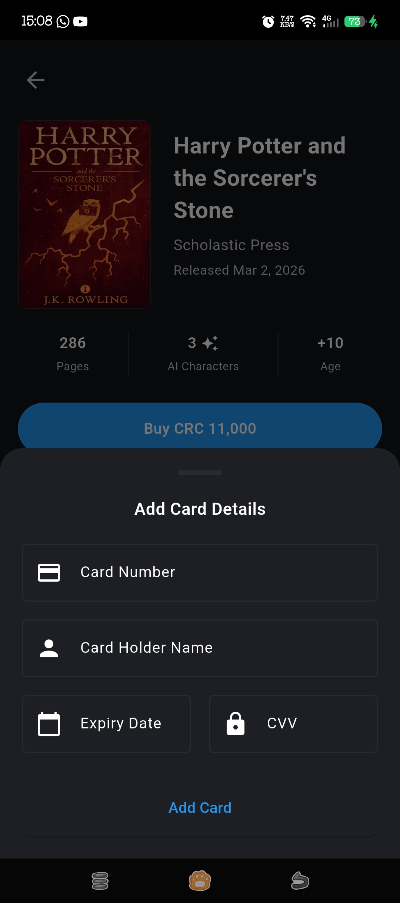

### 9. Perfil de usuario

  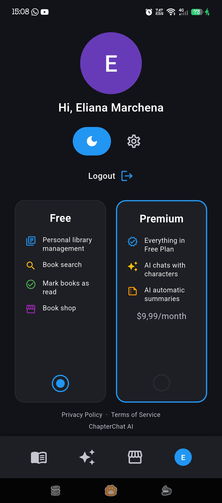

